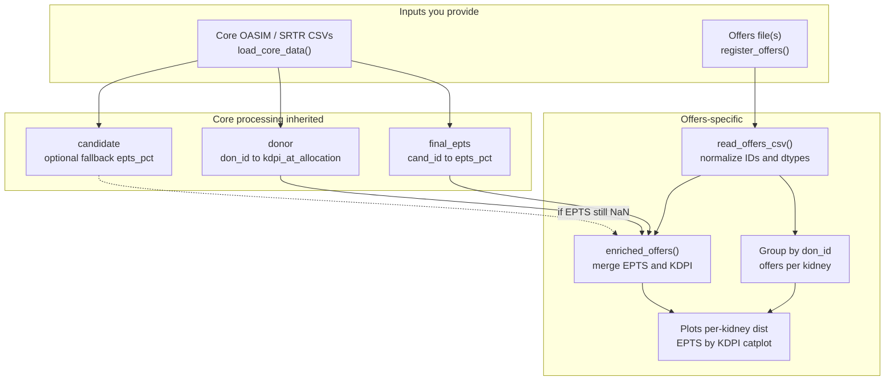

# Offers calculator: workflow and data flow

This document describes how **`OffersCalculator`** fits into the transplant-rates tooling: what you load, how rows are transformed, and what each output represents.

## Role in the package

| Component | Purpose |
|-----------|---------|
| **`TransplantRatesCalculator`** | Match-level outputs (who received which kidney), person-time, transplant rates. |
| **`OffersCalculator`** | *Offer*-level outputs: every row is one **offer** (a candidate listed in sequence for a given kidney). |

`OffersCalculator` **subclasses** `TransplantRatesCalculator`, so it uses the **same** simulation inputs (`load_core_data`) to obtain candidate EPTS and donor KDPI for joins.

## Flow diagram (Mermaid)

## Inputs

### 1. Core data (`load_core_data`)

Same as for transplant rates:

- Donor, candidate (KAS + time-varying), static, time-varying, removal, history CSVs
- Optional race CSV
- Simulation window `sim_begin_time` / `sim_end_time`
- OASIM version (`2023` vs `2024`) for column naming

From these, the parent class builds:

- **`final_epts`**: one EPTS value per `cand_id` at simulation context (via `epts_at_start`).
- **`final_cpra`**, filtered **static** candidates, etc.

### 2. Offers file(s) (`register_offers` then `get_offers`)

Expected columns (names are lowercased on read):

| Column | Meaning |
|--------|---------|
| `iteration` | Optional; simulation replicate index (default `0` if absent). |
| `don_id` | Kidney / donor identifier. |
| `cand_id` | Candidate offered this kidney at this rank. |
| `rank` | Offer position in the sequence for this kidney. |
| `segment` | Stratification label (e.g. allocation segment). |
| `accepted` | Whether this offer was accepted (`true`/`false` or boolean). |
| `probability` | Model probability (numeric). |

**Optional** (for **wait time at each offer** — needed for KDPI-by-wait analyses):

| Column | Meaning |
|--------|---------|
| `offer_datetime` / `offer_dt` / `offer_time` | Timestamp of the offer. With **`can_listing_dt`** from static (merged in `enriched_offers`), wait years = offer time − listing time. |
| `wait_time_years` / `wait_years` | Precomputed years waited at this offer. |
| `wait_time_days` / `wait_days` | Precomputed wait in days (converted to years). |

**Semantics:** Wait time is **per offer row**, not per candidate. Someone listed five years who receives offers in years 1–4 contributes **one row each** to the bins for those waits, not a single “five-year” bucket for the person.

## Identifier normalization

Offers and core tables sometimes disagree on ID type (**string vs float**, e.g. `"12345"` vs `12345.0`).

The pipeline applies **`_normalize_entity_id`** so `cand_id` / `don_id` match across:

- offers rows
- `final_epts`
- `donor`
- (fallback) `candidate` for EPTS

This fixes many cases where **`epts_pct` was all NaN** after a naive merge.

## Data transformations

### A. Offers per kidney (summary and distribution)

- **Definition**: For each kidney (`don_id`, and optionally each `iteration`), count **rows** = number of **offers** made for that kidney.
- **Outputs**: `offers_per_kidney_counts`, `summarize_offers_per_kidney`, `summarize_offers_per_kidney_by_segment`.
- **Plots**: `plot_offers_per_kidney_distribution` — histogram + empirical CDF of those counts.

If multiple iterations exist and you set `group_by_iteration=False`, counts pool across iterations on `don_id` only (a warning is logged).

### B. Enriched offers (`enriched_offers`)

1. Start from the offers table (normalized IDs).
2. **Left-merge** `final_epts` on `cand_id` to get `epts_pct`.
3. If **`epts_pct` is still missing** after the merge, **fallback**: look up the **last chronologically non-null** `epts_pct` per `cand_id` from **`candidate` ∪ `gen_hist`** (cached). This fixes cases where `groupby().last()` on candidate alone would pick a row with missing EPTS even though an earlier event had a value.
4. **Left-merge** `static` (one row per `cand_id`, latest `can_listing_dt` when duplicated) for **`real_age`** and **`can_age_at_listing`**.
5. **Left-merge** **`can_listing_dt`** alone (same dedupe rule) when present, for **offer-time − listing-time** wait computation.
6. **Left-merge** `donor` on `don_id` for **`kdpi_at_allocation`** and **`don_age`** (if that column exists).
7. Set **`offer_wait_years`**: use columns from the offers file if present; otherwise, when both **`offer_datetime`** and **`can_listing_dt`** exist, compute the difference in years. Negative values (offer before listing) are clipped to 0 and logged.

`final_epts` is **deduplicated** so duplicate `cand_id` rows prefer a **non-null** `epts_pct` when both exist.

Remaining gaps (~0.5% of rows is typical) are usually **cand_id** values that appear only in the simulation offers feed and not in the loaded candidate/history tables. Logs use **INFO** when the missing share is below 1% of rows, **WARNING** at or above; each message includes **distinct cand_id** count and a short **sample** of IDs.

### C. EPTS by KDPI visualization (`plot_epts_kdpi_catplot`)

1. Optionally keep **`accepted_only`** rows.
2. Coerce **`epts_pct`** and **`kdpi_at_allocation`** to numeric; drop rows still missing either.
3. Bin **`epts_pct`** on `[0,1]` with step `epts_step` (default `0.1`).
4. **Seaborn catplot**: EPTS bin on x, KDPI on y; **hue = policy** when comparing multiple offers files.

If no rows remain, the function logs **counts at each step** (raw rows, after acceptance filter, NaN EPTS, NaN KDPI) to simplify debugging.

### D. Candidate age vs donor age (`plot_candidate_donor_age`)

**Default:** ``sns.catplot`` — **binned candidate age** on x, **donor age** on y (same layout as EPTS×KDPI / KDPI by race). Bin width is ``age_bin_years`` (default 5); ``kind`` is e.g. ``box``, ``violin``, ``strip``.

**Optional:** ``as_scatter=True`` uses ``offers_candidate_donor_age_plot``: raw candidate age vs donor age with optional **y = x** line, policies as **hue**, **downsampling** when row counts are huge. **Not** EPTS on the x-axis.

### E. EPTS vs age (optional; `plot_epts_age_catplot`)

Same **EPTS bin** x-axis as the KDPI figure; **y** is one of **`real_age`**, **`can_age_at_listing`**, or **`don_age`**. Use when you want age *stratified* by EPTS, not candidate-vs-donor age.

### F. KDPI by recipient race (`summarize_kdpi_by_race` / `plot_kdpi_by_race`)

With **`load_core_data(..., race_path=...)`**, :meth:`enriched_offers` adds **`can_race_srtr`** (and ethnicity when present). **Given race**, you can summarize or plot the distribution of **donor KDPI** on offered kidneys: **``summarize_kdpi_by_race``** returns counts and mean/median/quantiles per race; **``plot_kdpi_by_race``** uses **``sns.catplot``** (``offers_kdpi_by_race_catplot``) — box / violin / strip of KDPI by race, with optional policy **hue**.

### G. KDPI by wait time at offer (`summarize_kdpi_by_wait_bin` / `plot_kdpi_by_wait_time`)

When **`offer_wait_years`** is populated (see optional offers columns and step 7 under **Enriched offers**), bin wait time with **`pd.cut`** (default edges **`DEFAULT_OFFER_WAIT_EDGES_YEARS`** in `offers_calculator.py`, overridable). **``summarize_kdpi_by_wait_bin``** aggregates KDPI per bin; **``plot_kdpi_by_wait_time``** draws a catplot (same bin edges as the summary when you pass **`wait_edges_years`** consistently). Without offer timestamps or precomputed wait columns, **`offer_wait_years`** is all missing and these methods have nothing to plot — extend the OASIM export or add columns.

## Visual style

Shared styling lives in **`plot_style.py`** (`apply_plot_style`, `spectral_colors`): **whitegrid**, **Spectral** colors, light **grid** (alpha about 0.3), **savefig** DPI **300**, consistent with the rest of **`plots.py`**.

## Outputs (artifacts)

| Artifact | Description |
|----------|-------------|
| Summary dict / DataFrame | Mean/median/etc. of offers-per-kidney (overall or by `segment`). |
| PNG figures | Per-kidney distribution; EPTS-bin by KDPI catplot; KDPI by wait-time bins; etc. |
| Logs | Merge gaps, fallback fills, multi-iteration pooling warnings. |

## Typical notebook sequence

1. `OffersCalculator(sim_begin, sim_end, cache_dir=...)`
2. `load_core_data(...)`
3. `register_offers([path1, path2, ...], name_map={...})`
4. `summarize_offers_per_kidney(path)` / `summarize_offers_per_kidney_by_segment(path)`
5. `plot_offers_per_kidney_distribution(path)`
6. `enriched_offers(path)` (inspect columns)
7. `plot_epts_kdpi_catplot([path1, path2])`
8. If offers include wait time or offer timestamps: `summarize_kdpi_by_wait_bin(path)` / `plot_kdpi_by_wait_time([path1, path2])`

For match-level outputs and person-time, see the main README and `TransplantRatesCalculator`.
